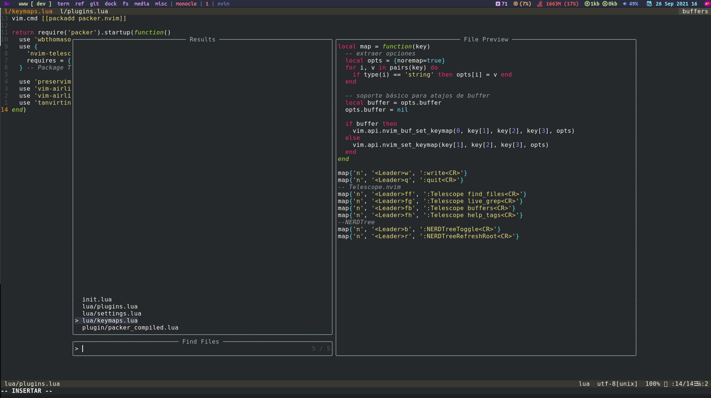

# Setup NVIM


## Get started
Manejador de plugins recomendado
```bash
git clone --depth 1 https://github.com/wbthomason/packer.nvim\
 ~/.local/share/nvim/site/pack/packer/start/packer.nvim
```

Luego de tener el manejador de plugins instalado usar el siguiente comando en nvim
```bash
:PackerInstall
```
